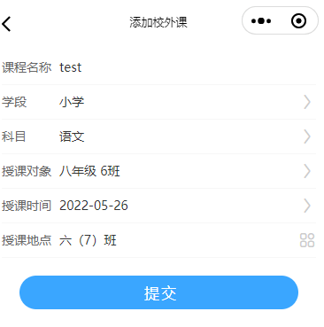

## 我要听课 -> 推门听课

api `/lecture/v1/listenlist` 缺少[学段][班级][科目][关键字][日期]过滤

## [添加校外课] api 问题

添加校外课 api: `/lecture/v1/addTempOpenCourse` [公开课/添加临时公开课](https://doc.shenduedu.com/#/小π智听/公开课/添加临时公开课)

::: warning 参数字段 teach_target 问题

年级班级是字符串？？用户可以随便填？

```json:no-line-numbers{5}
{
  "course_name": "公开课测试",
  "subject_id": 1,
  "period": 1001,
  "teach_target": "一年级三班学生",
  "lesson_date": "2018-01-13",
  "start_time": "10:20:00",
  "user_name": "黄建辉",
  "class_room_name": "报告厅",
  // false 校外课 true 校内课
  "is_self": "false"
}
```

:::

功能界面：



## [授课记录-详情页] [授课记录-听课老师名单] api

[详情页、听课老师名单 api](https://doc.shenduedu.com/#/小π智听/公开课/获取所有过程记录) ：`/lecture/v1/allrecordlist`

::: warning 缺少

每个指标的选中人数，这个还没有

:::

[需求详情请点击](https://oe3lc5.axshare.com/#id=742g8j&p=%E5%90%AC%E8%AF%84%E8%AF%BE%E8%AE%B0%E5%BD%95&g=1)

## 统计

### [我的-校领导]我的评课统计、钉钉评课记录、查看钉钉评课记录

[详情请点击](https://oe3lc5.axshare.com/#id=co74ar&p=%E6%88%91%E7%9A%84-%E6%99%AE%E9%80%9A%E8%80%81%E5%B8%88&g=1)

### [我的-科组长]科组评课统计、科组听评课记录

[详情请点击](https://oe3lc5.axshare.com/#id=x4o7fc&p=%E6%88%91%E7%9A%84-%E7%A7%91%E7%BB%84%E9%95%BF&g=1)

### [我的-校领导]全校评课统计、全校听评课记录

[详情请点击](https://oe3lc5.axshare.com/#id=12awli&p=%E6%88%91%E7%9A%84-%E6%A0%A1%E9%A2%86%E5%AF%BC&g=1)
