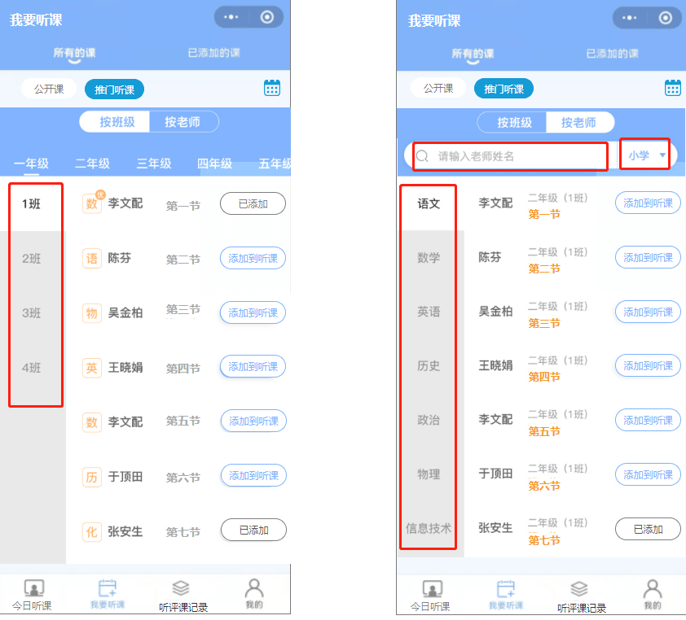

## 首页

`/lecture/v1/lesson_count` [获取最近一周添加的听课任务数量](https://doc.shenduedu.com/#/小π智听/公开课/获取最近一周添加的听课任务数量) 报 404

## 直播听课

应该用哪个 api？

## 我要听课 -> 推门听课

`/lecture/v1/listenlist` 缺少第几节课字段，如图：

## 缺少 [添加校外课] api

## 缺少 [授课记录-详情页] [授课记录-听课老师名单] api

[需求详情请点击](https://oe3lc5.axshare.com/#id=742g8j&p=%E5%90%AC%E8%AF%84%E8%AF%BE%E8%AE%B0%E5%BD%95&g=1)

## 统计

### [我的-校领导]我的评课统计、钉钉评课记录、查看钉钉评课记录

[详情请点击](https://oe3lc5.axshare.com/#id=co74ar&p=%E6%88%91%E7%9A%84-%E6%99%AE%E9%80%9A%E8%80%81%E5%B8%88&g=1)

### [我的-科组长]科组评课统计、科组听评课记录

[详情请点击](https://oe3lc5.axshare.com/#id=x4o7fc&p=%E6%88%91%E7%9A%84-%E7%A7%91%E7%BB%84%E9%95%BF&g=1)

### [我的-校领导]全校评课统计、全校听评课记录

[详情请点击](https://oe3lc5.axshare.com/#id=12awli&p=%E6%88%91%E7%9A%84-%E6%A0%A1%E9%A2%86%E5%AF%BC&g=1)
