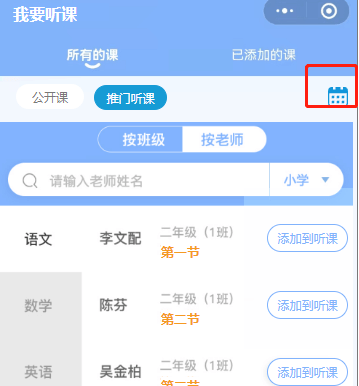

::: danger 问题

添加公开课 /lecture/v1/requestOpenCourse ，除了附件 `oca` 字段外，其他都必填？ 当缺少 `class_room_id` 字段也会报错 `bad request`，不是可以自定义输入地点吗？

:::

::: warning 缺少

/lecture/v1/getCurriculum 缺少 date 参数

:::

## 全校 - 科组统计次数

::: warning 问题

/lecture/v1/statisticsv1 空数据，明明是有数据的

:::

## 听评课记录详情

::: danger 问题

/lecture/v1/list?course_id=5567019870354718065&user_id=467067 需要 dimension_item_name 字段，显示需要

涉及到的页面路径： pages/ListenRecordDetails/ListenRecordDetails 、 pages/ListenEvaluationDetails/ListenEvaluationDetails

:::

## 听评课记录 - 科组、全校

::: danger 问题

/lecture/v1/statsCoursesFrequenceOfACampus 能查全校或者个人，如果是 [我的 -> 科组听评课记录] 应该怎么搞？

- 老师可能有多个科组
- 需要支持 date_start date_end
- 缺少老师名称过滤

:::

## 钉钉评课记录

::: warning 缺少

/lecture/v1/courses_with_recording_resource 缺少的参数：

    date_start
    date_end
    keyword
    offset
    list_mun

:::

<!-- ## 我要听课 -> 推门听课

[需求详情 | 原型](https://oe3lc5.axshare.com/#id=ap5y1y&p=我要听课&g=1)

::: warning 缺少

api `/lecture/v1/listenlist` 缺少[学段][班级][科目][关键字][日期]过滤

::: -->

<!-- ## 统计

### [我的-校领导]我的评课统计、钉钉评课记录、查看钉钉评课记录

[详情请点击](https://oe3lc5.axshare.com/#id=co74ar&p=%E6%88%91%E7%9A%84-%E6%99%AE%E9%80%9A%E8%80%81%E5%B8%88&g=1)

### [我的-科组长]科组评课统计、科组听评课记录

[详情请点击](https://oe3lc5.axshare.com/#id=x4o7fc&p=%E6%88%91%E7%9A%84-%E7%A7%91%E7%BB%84%E9%95%BF&g=1)

[科组听评课记录 api](https://doc.shenduedu.com/#/%E5%B0%8F%CF%80%E6%99%BA%E5%90%AC/%E7%BB%9F%E8%AE%A1/%E7%BB%9F%E8%AE%A1%E6%A0%A1%E5%8C%BA%E6%89%80%E6%9C%89%E6%95%99%E5%B8%88%E7%9A%84%E6%8E%88%E8%AF%BE%E5%92%8C%E5%90%AC%E8%AF%BE%E6%AC%A1%E6%95%B0)

### [我的-校领导]全校评课统计、全校听评课记录

[详情请点击](https://oe3lc5.axshare.com/#id=12awli&p=%E6%88%91%E7%9A%84-%E6%A0%A1%E9%A2%86%E5%AF%BC&g=1)
 -->
