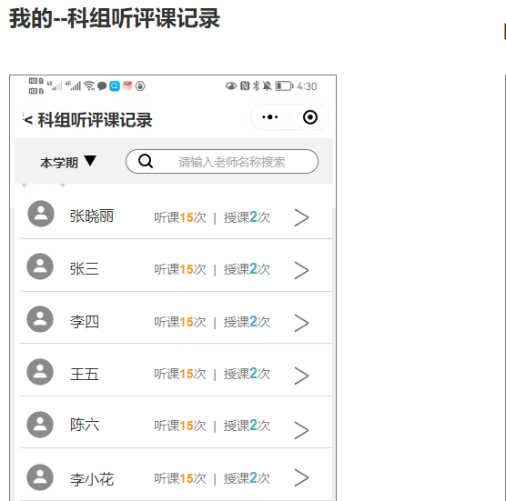
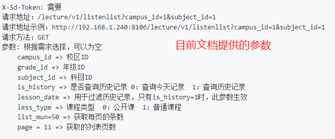
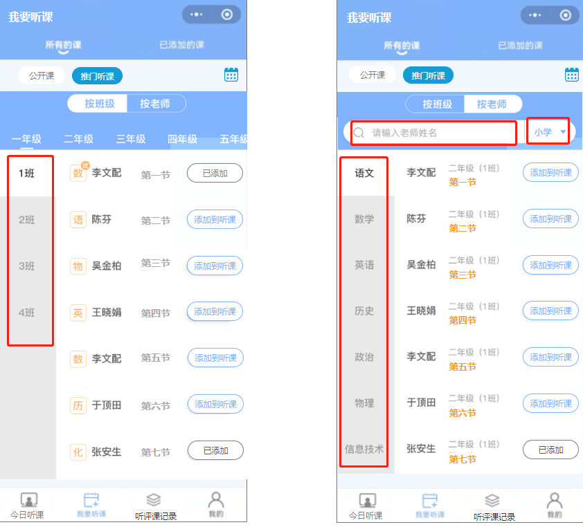
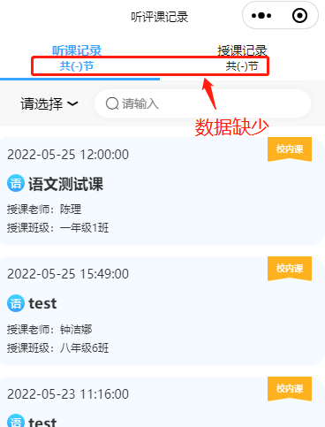

::: warning 缺少

目前只发现这个接口 /lecture/v1/statsCoursesFrequenceOfACampus 最接近了

- 但老师可能有多个科组，这个接口只能指定一个科组。。
- 缺少学年过滤，只好支持 date_start date_end
- 缺少老师名称过滤

:::

## 我要听课 -> 推门听课

[需求详情 | 原型](https://oe3lc5.axshare.com/#id=ap5y1y&p=我要听课&g=1)

::: warning 缺少

api `/lecture/v1/listenlist` 缺少[学段][班级][科目][关键字][日期]过滤

:::

## [听评课记录]

::: warning 缺少

:::

## [添加校外课] api 问题

添加校外课 api: `/lecture/v1/addTempOpenCourse` [公开课/添加临时公开课](https://doc.shenduedu.com/#/小π智听/公开课/添加临时公开课)

功能界面：

## [授课记录-听课老师名单] api

[需求详情请点击](https://oe3lc5.axshare.com/#id=742g8j&p=%E5%90%AC%E8%AF%84%E8%AF%BE%E8%AE%B0%E5%BD%95&g=1)

## 统计

### [我的-校领导]我的评课统计、钉钉评课记录、查看钉钉评课记录

[详情请点击](https://oe3lc5.axshare.com/#id=co74ar&p=%E6%88%91%E7%9A%84-%E6%99%AE%E9%80%9A%E8%80%81%E5%B8%88&g=1)

### [我的-科组长]科组评课统计、科组听评课记录

[详情请点击](https://oe3lc5.axshare.com/#id=x4o7fc&p=%E6%88%91%E7%9A%84-%E7%A7%91%E7%BB%84%E9%95%BF&g=1)

[科组听评课记录 api](https://doc.shenduedu.com/#/%E5%B0%8F%CF%80%E6%99%BA%E5%90%AC/%E7%BB%9F%E8%AE%A1/%E7%BB%9F%E8%AE%A1%E6%A0%A1%E5%8C%BA%E6%89%80%E6%9C%89%E6%95%99%E5%B8%88%E7%9A%84%E6%8E%88%E8%AF%BE%E5%92%8C%E5%90%AC%E8%AF%BE%E6%AC%A1%E6%95%B0)

### [我的-校领导]全校评课统计、全校听评课记录

[详情请点击](https://oe3lc5.axshare.com/#id=12awli&p=%E6%88%91%E7%9A%84-%E6%A0%A1%E9%A2%86%E5%AF%BC&g=1)
